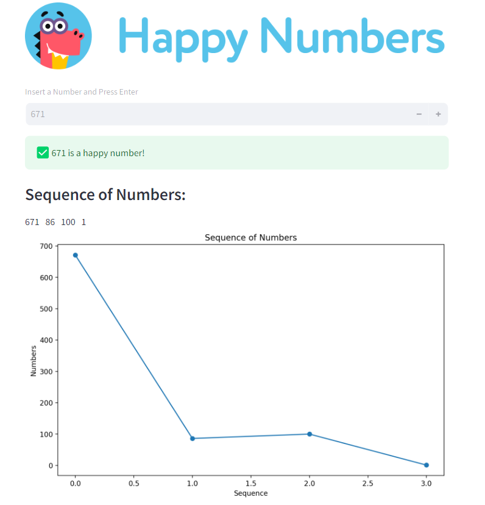

# Happy Numbers Checker

This project includes a Python module to determine if a given number is a happy number, a Streamlit app for visualizing the process, and tests to ensure the correctness of the implementation.

<p align="center">
    
</p>

- [Happy Numbers Checker](#happy-numbers-checker)
  - [Introduction](#introduction)
  - [Installation](#installation)
  - [Usage](#usage)
    - [Happy Numbers Module](#happy-numbers-module)
    - [Running the Streamlit App](#running-the-streamlit-app)
    - [Running Tests](#running-tests)

## Introduction

A happy number is defined by the following process:
Starting with any positive integer, replace the number by the sum of the squares of its digits, and repeat the process until the number either equals 1 (where it will stay), or it loops endlessly in a cycle that does not include 1. Numbers for which this process ends in 1 are considered happy numbers.

## Installation

1. Clone the repository:
    ```bash
    git clone https://github.com/somayehpakdel/Python_Projects.git
    cd '05 happy_numbers'
    ```

2. Create a virtual environment and activate it:
    ```bash
    python -m venv venv
    source venv/bin/activate  # On Windows use `venv\Scripts\activate`
    ```

3. Install the required packages:
    ```bash
    pip install -r requirements.txt
    ```

## Usage

### Happy Numbers Module

The `happy_numbers.py` module contains the function to check if a number is happy.

Example:
```python
from src.happy_number import happy_numbers

result, sequence = happy_numbers(19)
print(f"Is 19 a happy number? {result}")
print(f"Sequence: {sequence}")
```

### Running the Streamlit App

To run the Streamlit app, use the following command:
```bash
streamlit run app.py
```

This will start a local server where you can interact with the happy numbers checker and visualize the sequence of numbers.

### Running Tests

To run the tests, use the following command:
```bash
pytest test_happy_numbers.py
```

This will execute the test cases to ensure the correctness of the `happy_numbers` function.
