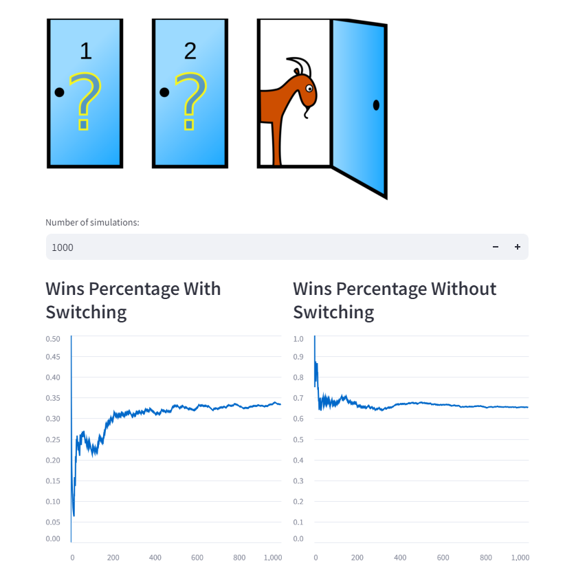

# Monty Hall Simulation

This repository contains a simulation of the famous Monty Hall problem, which demonstrates the counterintuitive probability involved in a game show scenario. The simulation is implemented in Python and includes both a command-line interface and a web application using Streamlit.

- [Monty Hall Simulation](#monty-hall-simulation)
  - [Overview](#overview)
  - [Files Structure](#files-structure)
  - [Installation](#installation)
  - [Usage](#usage)
    - [Command Line Interface](#command-line-interface)
    - [Streamlit Application](#streamlit-application)
  - [Testing](#testing)

## Overview

The Monty Hall problem is based on a game show where a contestant is presented with three doors. Behind one door is a car (the prize), and behind the other two doors are goats. After the contestant makes an initial choice, the host opens one of the other doors to reveal a goat. The contestant then has the option to switch their choice to the remaining unopened door or stick with their original choice. This simulation explores the outcomes of both strategies (switching vs. not switching) over multiple trials.

<p align="center">
    
</p>

## Files Structure
```
└── 📁06 monty_hall_problem_simulation
    └── 📁images
    └── 📁src
        └── app.py
        └── monty_hall.py
    └── 📁tests
        └── test_monty_hall.py
    └── README.md
    └── requirements.txt
```

- **mont_hall.py**: Contains the core logic for simulating the Monty Hall problem.
- **app .py**: A Streamlit application that allows users to visualize the results of the simulation.
- **test_mont_hall.py**: Contains unit tests for the functions in mont_hall.py.

## Installation

To run this project, you'll need Python 3.x installed on your machine. You can install the required dependencies using pip:
```bash
pip install -r requirements.txt
```

## Usage

### Command Line Interface

To run the simulation from the command line, use the following command:
```bash
python mont_hall.py
```

This will run the simulation with a default of 100,000 trials and print the results.

### Streamlit Application

To run the Streamlit web application, execute:
```bash
streamlit run app.py
```

This will start a local server, and you can interact with the simulation through your web browser.

## Testing

You can run tests using pytest. To execute the tests, run:
``` bash
pytest test_mont_hall.py
```

This will validate the functionality of the Monty Hall simulation and ensure everything works as expected.
