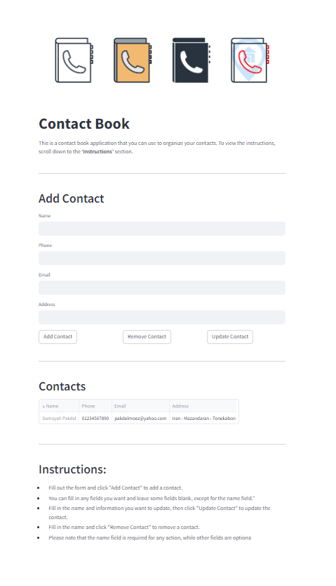

# Contact Book

A simple and interactive contact management application built with Python and Streamlit. This application allows users to add, update, remove, and view contacts with essential details such as phone numbers, email addresses, and addresses.

<p align="center">
    
</p>

## File Structure
```
└── 📁07 contact book
    └── 📁images
    └── 📁src
        └── app.py                  # Main Streamlit app file
        └── contact_book.py         # Core logic for managing contacts
        └── utils.py                # Utility functions for validation
    └── 📁tests
        └── test_contact_book.py    # Unit tests for the application
    └── README.md
    └── requirements.txt
```

## Features

- **User-Friendly Interface**: Built with Streamlit for an intuitive web interface.
- **Add Contacts**: Easily add new contacts with name, phone number, email, and address.
- **Remove Contacts**: Remove existing contacts by name.
- **Update Contacts**: Modify details of existing contacts.
- **View Contacts**: Retrieve and display all contacts in a clear format.
- **Validation**: Basic validation for phone numbers and email addresses.

## Requirements

- Python 3.x
- Streamlit
- Pandas (for data handling)
- pytest (for testing, optional)


## Installation

1. Clone the repository:
```bash
   git clone https://github.com/yourusername/contact_book.git
   cd contact_book
```

2. Create a virtual environment (optional but recommended):
```bash
   python -m venv venv
   source venv/bin/activate  # On Windows use venv\Scripts\activate
```

3. Install the required packages:
```bash
   pip install -r requirements.txt
```

## Usage

To run the Contact Book application with Streamlit, execute the following command in your terminal:

```bash
streamlit run src/app.py
```
This will start a local web server and open the application in your default web browser.


## Testing

To run the tests for this application, you can use pytest. Ensure you have pytest installed, then run:
```bash
pytest tests/test_contact_book.py
```