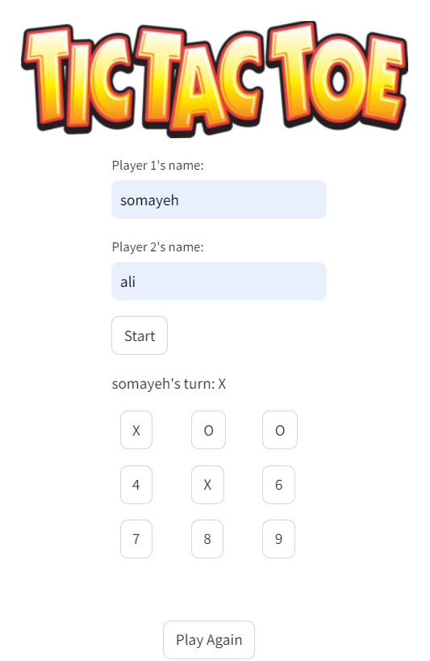

# Tic Tac Toe Game

A simple Tic Tac Toe game built with Python using Streamlit for the user interface and pytest for testing. This project allows two players to play Tic Tac Toe in their web browser.

## Features

- Two-player game mode
- Interactive web interface using Streamlit
- Unit tests for game logic using pytest

<p align="center">
    
</p>

## File structure
```
📁08 tic_tac_toe
  └── 📁images
  └── 📁src
      └── app.py
      └── tic_tac_toe.py
  └── 📁tests
      └── test_tic_tac_toe.py
  └── README.md
  └── requirements.txt
```

## Installation

1. **Clone the repository:**

```bash
git clone (https://github.com/somayehpakdel/Python_Projects.git
cd '01 level I/08 tic_tac_toe'
```

2. **Install the required packages:**

```bash
   pip install -r requirements.txt
```

## Running the Game

To start the Tic Tac Toe game, run the following command:

```bash
streamlit run src/app.py
```
This will start a local web server and open the application in your default web browser.

## Running Tests

To run the unit tests, execute:

``` bash
pytest tests/test_tic_tac_toe.py
```
