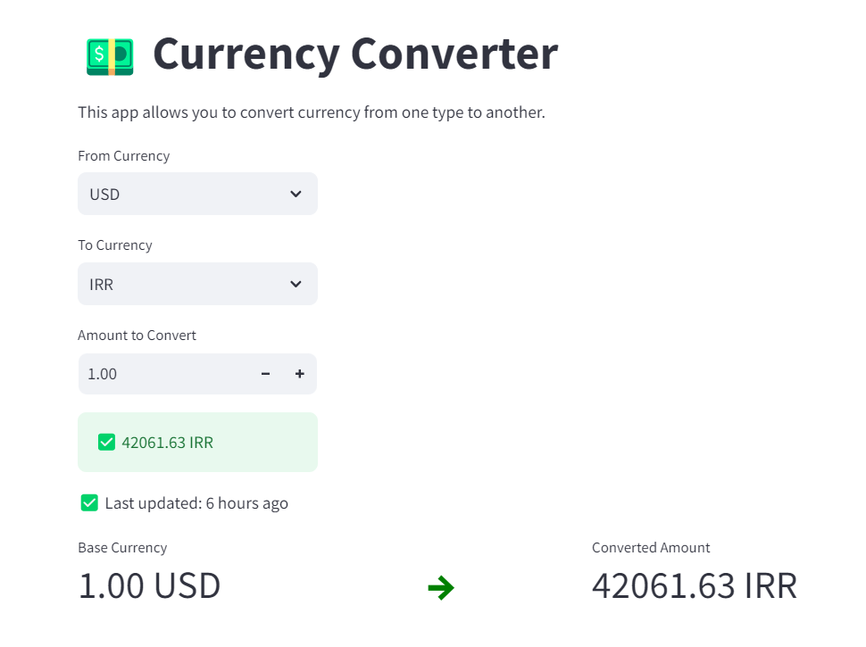

# Currency Converter

A Python-based currency converter that fetches real-time exchange rates and converts between different currencies. This project includes caching and logging to enhance performance and traceability. Additionally, it comes with a Streamlit app for a better user interface.

## Key Features

- **Real-time Exchange Rates**: Fetches the latest exchange rates from an external API.
- **Caching**: Utilizes `cachetools.TTLCache` to store exchange rates for one hour, reducing the number of API calls.
- **Error Handling**: Handles various error scenarios, including invalid currency codes and network-related errors.
- **Logging**: Logs important events and errors for better traceability.
- **Streamlit App**: Provides a user-friendly interface for currency conversion.
- **using pytest**: To test currency conversion functions by mocking requests.get and fixtures to clear the cache. 

<p align="center">
    
</p>

## Installation

1. Install the required dependencies:
 ```bash
 pip install -r requirements.txt
 ```

2. Install type stubs for `requests` and `cachetools`:
 ```bash
 python3 -m pip install types-requests types-cachetools
 ```

## Usage

**Streamlit App**:
To run the Streamlit app, use the following command:
 ```bash
 streamlit run app.py
 ```
 This will launch a web interface where you can input the base currency, target currency, and amount to convert. The app will display the converted amount and the exchange rate information.
