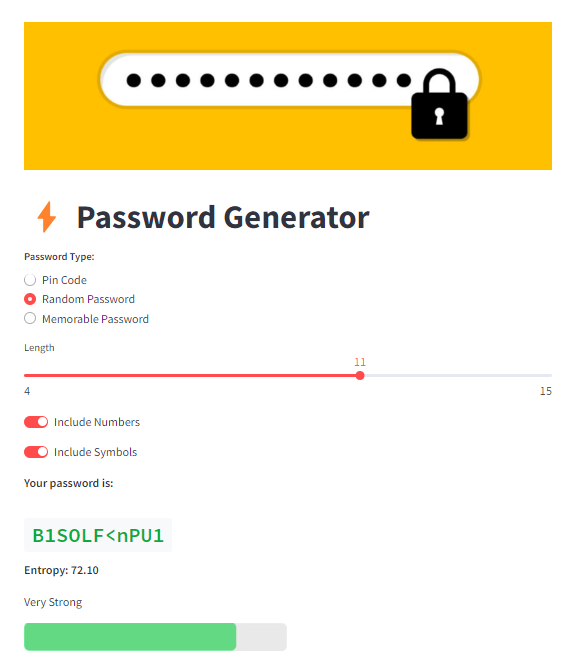

# Password Generator Dashboard

## Overview
This is a simple web application built with Streamlit that allows users to generate different types of passwords, including Pin Codes, Random Passwords, and Memorable Passwords. The application utilizes the Natural Language Toolkit (NLTK) for generating memorable passwords and provides feedback on the strength of the generated password.

This repository contains a Streamlit dashboard for the Password Generator project (`main_oop.py`). For more details about this project, including design decisions and implementation specifics, please visit [Password Generator](https://github.com/somayehpakdel/Python_Projects/tree/main/password_generator).

<p align="center">
    
</p>

## Features
- **Password Types**: Choose between three types of passwords:
  - **Pin Code**: Numeric codes of a specified length.
  - **Random Password**: Alphanumeric passwords with optional symbols.
  - **Memorable Password**: A combination of words from a predefined vocabulary.

- **Password Strength Evaluation**: The application evaluates the strength of the generated password based on its entropy and provides visual feedback.

- **Dynamic Inputs**: Use sliders and toggles to customize the length and characteristics of the passwords.

## Requirements
To run this application, ensure you have the following libraries installed:

- Streamlit
- NLTK

You can install the required libraries using pip:

```bash
pip install streamlit nltk
```
Make sure to download the NLTK words corpus as well:

```python
import nltk
nltk.download('words')
```

## Usage
1. Clone or download this repository.
2. Navigate to the project directory in your terminal.
3. Run the Streamlit application using the following command:

```bash
streamlit run app.py
```

4. Open your web browser and go to http://localhost:8501 to view the application.


## Acknowledgments
- [Streamlit](https://streamlit.io/) for providing an easy way to build interactive web applications.
- [NLTK](https://www.nltk.org/) for natural language processing capabilities.
